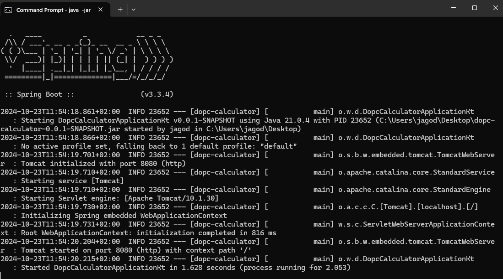

# $\color{rgb(60,143,201)}{\textsf{About project}}$

Application created for Osstra test assignment. Allows to post messages, 
get new/all messages, 
delete one or multiple messages.

## $\color{rgb(107, 187, 242)}{\textsf{Technologies and tools}}$

Java, Spring Boot, Maven, Jacoco, Junit5, testcontainers, postgresql

## $\color{rgb(107, 187, 242)}{\textsf{How to run project}}$

> [!NOTE]
> Make sure you also have installed docker (on Windows docker desktop).
>Make sure you have jdk (you can confirm that by entering java -version)
>on your computer if you don't you can download one [here](https://www.oracle.com/java/technologies/downloads/#java21)
>Make sure to set environment variables.
>Windows:
>You can go directly to EnvironmentVariables and add it directly to system variables or enter in cmd:
>```
>set JAVA_HOME=C:\Program Files\Java\jdk-21.0.4 - adjust if you using different version
>set PATH=%PATH%;%JAVA_HOME%\bin
>```
>Linux/Mac:
>```
>export JAVA_HOME=/Library/Java/JavaVirtualMachines/jdk-21.0.4.jdk/Contents/Home - adjust if you using different version
>export PATH=$JAVA_HOME/bin:$PATH
>```
>Recommended version 21.0.4.

Once you have everything installed and set up
clone repository.
In order to do that use command:

```
   git clone https://github.com/JagodaBodnar/osttra-test.git  // you can use also ssh
```

> [!IMPORTANT]  
> You need to add file .env (content provided by email) and secret.yml inside resources 
>in main folder content also provided by email.

After creating files enter command in the main folder of repository:
```
 maven clean install
```
```
 docker-compose up
```
in new terminal window run another command:
```
 java -jar target/osttra-test-0.0.1-SNAPSHOT.jar
```

Once you run it you should see confirmation in terminal


To send request you can use curl** [Postman](https://www.postman.com/) or even browser to send request.

** make sure to install curl first if you don't have it already, on windows
you can do that by entering command:

```
@"%SystemRoot%\System32\WindowsPowerShell\v1.0\powershell.exe" -NoProfile -InputFormat None -ExecutionPolicy Bypass -Command "iex ((New-Object System.Net.WebClient).DownloadString('https://chocolatey.org/install.ps1'))" && SET "PATH=%PATH%;%ALLUSERSPROFILE%\chocolatey\bin"
```

and then:

```
choco install curl
```
## $\color{rgb(107, 187, 242)}{\textsf{How to open code and run application from IDE}}$

Clone project from github:
```
  git clone http or ssh address of the repository 
```
```
  File ⟶ Open ⟶ navigate to place where you unpacked folder and choose osttra-test folder
```

> [!IMPORTANT]  
> You need to add file .env (content provided by email) and secret.yml inside resources
>in main folder content also provided by email.

The easiest way to run application is by opening OsttraTestApplication.kt
that exists in src/main/kotlin/org.osttra package and clicking
green arrow on the left margin.
You can also right-click on the file and select Run 'OsttraTestApp...main()'
or by pressing combination Ctrl + Shift + F10.
Either way you should see in the terminal the same thing as presented in the first approach.
Here however you can review code.

## $\color{rgb(107, 187, 242)}{\textsf{Tests}}$

Tests created for that project are unit tests to run tests you can either enter command:

```
mvn clean package
```

or

```
 mvn clean test
```

Or you can run them directly in the test units.

# $\color{rgb(107, 187, 242)}{\textsf{Using application}}$

## $\color{rgb(245, 179, 66)}{\textsf{Users}}$

Application contains user table with prepopulated 3 users that you can use for message fetching and posting.
If you however are not satisfied you can create your own user using endpoint:

### $\color{rgb(245, 179, 66)}{\textsf{1. POST /api/users}}$

   Request body template:

 ```
    {
        "firstName": "Emma",
        "lastName": "Eriksson",
        "email": "emma.eriksson@gmail.com"
    }
```

in response, you will receive UUID of created user that you can use to fetch data.

## $\color{rgb(245, 179, 66)}{\textsf{Messages - endpoints}}$

### $\color{rgb(245, 179, 66)}{\textsf{1. POST /api/messages}}$

Request body template:

 ```
    {
        "recipientId": "00bded6f-96b0-432c-abfe-d85d1129ae29", 
        "message": "Remember about meeting tomorrow at 11:00."
    }
```

    Expected response code: 201 - Created

### $\color{rgb(245, 179, 66)}{\textsf{2. GET /api/messages/new/{recipient}}}$

Returns a list of all new messages for specified id of recipient.
You can also specify how many elements you want per page or page number you want to display.
### /api/messages/new/{recipient}?size=2&page=1
Expected response structure:

```
{
    "content": [
        {
            "id": 6,
            "content": "Remember about meeting tomorrow at 11:00.",
            "date": "2024-10-28T00:48:42.194121"
        }
    ],
    "page": {
        "size": 1,
        "number": 0,
        "totalElements": 1,
        "totalPages": 1
    }
}
```

    Expected response code: 200 - OK

### $\color{rgb(245, 179, 66)}{\textsf{3. GET /api/messages/all/{recipient}}}$

   Returns a list of all messages for specified id of recipient.
   You can also pass RequestParams specifying page number and size like in point 2. 
   ```
   
   ```
   Expected response structure:

```
{
    "content": [
        {
            "id": 6,
            "content": "Remember about meeting tomorrow at 11:00.",
            "date": "2024-10-28T00:48:42.194121"
        }
        {
            "id": 7,
            "content": "Remember about meeting tomorrow at 12:00.",
            "date": "2024-10-28T00:48:43.194121"
        }
    ],
    "page": {
        "size": 2,
        "number": 0,
        "totalElements": 2,
        "totalPages": 1
    }
}
```

    Expected response code: 200 - OK

### $\color{rgb(245, 179, 66)}{\textsf{4. DELETE /api/messages/\{id\}}}$

   Removes from database message with specified id. 
   If id does not exist response will be 404.

```
    Expected response code: 204 - No Content
```
### $\color{rgb(245, 179, 66)}{\textsf{5. DELETE /api/messages}}$

   Removed multiple messages at once according to provided list of ids.

Request body template:

 ```
    {
        "ids": [1,2,3]
    }
```

    Expected response code: 204 - No content

## $\color{rgb(107, 187, 242)}{\textsf{Folder structure}}$

```bash
├───main
│   ├───java
│   │   └───org
│   │       └───osttra
│   │           ├───exceptions
│   │           ├───message
│   │           │   ├───controller
│   │           │   ├───dtos
│   │           │   ├───repository
│   │           │   │   └───model
│   │           │   └───service
│   │           └───user
│   │               ├───controller
│   │               ├───dto
│   │               ├───repository
│   │               │   └───model
│   │               └───service
│   └───resources
└───test
    ├───java
    │   └───org
    │       └───osttra
    │           ├───integrationtests
    │           └───unittests
    │               ├───message
    │               └───user
    └───resources

```
